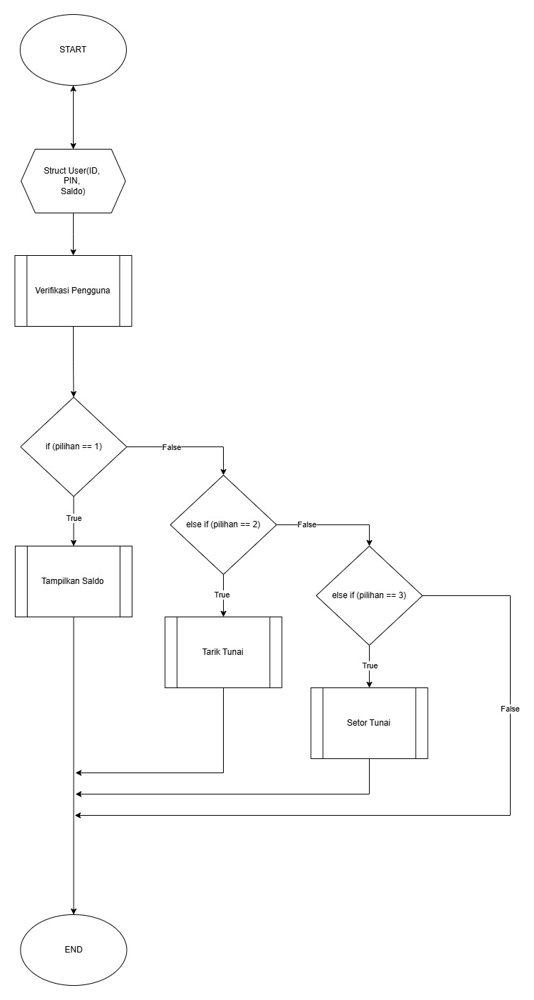

<!-- @import "[TOC]" {cmd="toc" depthFrom=1 depthTo=6 orderedList=false} -->
# Tugas Fungsi

## Ahmad Faizur Rahman | D121241107


<br>

### Nomor 1
Buat program ATM sederhana dengan fitur: cek saldo, tarik tunai, dan setor tunai. Gunakan fungsi untuk mengecek saldo dan melakukan perhitungan setelah transaksi. Gunakan prosedur untuk menampilkan menu dan hasil transaksi. Simpan saldo sebagai variabel global atau parameter yang diperbarui dalam setiap transaksi.

<br>

* **Flowchart**:




<br>
<br>
<br>

* **Code di C**

<br>

```C
#include <stdio.h>
#include <stdlib.h>

typedef struct {
    unsigned int id;
    unsigned int pin;
    unsigned int balance;
}User;

User users[] = {
    {11111111, 222222, 1000000},
    {87654321, 654321, 2000000},
    {11223344, 334455, 1500000},
    {44332211, 554433, 1750000},
    {56789012, 789012, 1200000},
    {21098765, 987654, 1800000},
    {34567890, 678901, 1300000},
    {65432109, 321098, 1600000}
};

int fnUserMenu(void)
{
    int iPilihan = -1;

    printf("\n============================\n");
    printf("        🏧 ATM Sederhana       \n");
    printf("============================\n");
    printf("[1] 💰 Cek Saldo\n");
    printf("[2] 💵 Tarik Tunai\n");
    printf("[3] 🏦 Setor Tunai\n");
    printf("[0] 🚪 Keluar\n");
    printf("============================\n");
    printf("Pilih menu: ");

    scanf("%i", &iPilihan);

    if (iPilihan < 0 || iPilihan > 3) {
        printf("Invalid Input. coba lagi.\n");
        fnUserMenu();
    }
    return iPilihan;
}

void fnMenuCallback(void)
{
    char cConfirmation;
    printf("Do you want to do another process [y/n]? ");
    scanf(" %c", &cConfirmation);

    if (cConfirmation == 'y' || cConfirmation == 'Y') {
        fnUserMenu();
    } else if (cConfirmation == 'n' || cConfirmation == 'N') {
        printf("Terima kasih telah menggunakan layanan kami.\n");
        exit(0);
    } else {
        printf("Invalid input. Please try again.\n");
        fnMenuCallback();
    }
}

int fnUserValidation(void)
{
    unsigned int uCardId, uPinNumber;
    printf("Enter your Card ID:  ");
    scanf("%u", &uCardId);

    printf("\nEnter your PIN number: ");
    scanf("%u", &uPinNumber);

    int iStructSize = sizeof(users)/ sizeof users[0];
    for (int i = 0; i < iStructSize; i++){
        if (users[i].id == uCardId && users[i].pin == uPinNumber){
            return i;
        }
    }
    printf("\nNo user data found, process terminated\n");
    return -1;
}

void fnDisplayBalance(int iIndex)
{
    int iUserBalance = users[iIndex].balance;

    printf("Sisa saldo anda:    \n");
    printf("%i\n", iUserBalance);

    fnMenuCallback();
}

void fnWithdrawBalance(int iIndex)
{
    unsigned int uWBalance;
    unsigned int uUserBalance = users[iIndex].balance;

    printf("Jumlah yang ingin ditarik:  \n");
    scanf("%u", &uWBalance);

    if (uWBalance > uUserBalance) {
        printf("Saldo anda tidak cukup\n");
        exit(0);
    }

    unsigned int* pBalance = &users[iIndex].balance;
    *pBalance -= uWBalance;
    printf("Penarikan berhasil. Sisa saldo anda: %u\n", users[iIndex].balance);

    fnMenuCallback();
}

void fnDepositBalance(int iIndex)
{
    unsigned int uDBalance;
    unsigned int uUserBalance = users[iIndex].balance;

    printf("Jumlah yang ingin dimasukkan:   \n");
    scanf("%u", &uDBalance);

    unsigned int* pBalance = &users[iIndex].balance;
    *pBalance = uUserBalance + uDBalance;

    printf("Berhasil menyetor, saldo anda sebesar: %u\n", users[iIndex].balance);

    fnMenuCallback();
}

int main(void)
{
    int iUserIndex = 1;

    int iUserChoice = fnUserMenu();

    if (iUserChoice == 1) {
        fnDisplayBalance(iUserIndex);
    }
    else if (iUserChoice == 2) {
        fnWithdrawBalance(iUserIndex);
    }
    else if (iUserChoice == 3) {
        fnDepositBalance(iUserIndex);
    }
    else{
        printf("Terima kasih telah menggunakan layanan kami.\n");
    }
    return 0;
}

```
<br>

### Nomor 2
Implementasikan fungsi rekursif untuk menghitung faktorial Implementasikan fungsi rekursif untuk menghitung bilangan Fibonacci ke-n. Gunakan prosedur untuk menampilkan hasil perhitungan.

<br>

* **Pseudocode:**

```ps
Start
    Function fnRecursiveFactorial(iParameter):
        If iParameter equals 1:
            Return 1
        End If

        Return iParameter multiplied by fnRecursiveFactorial(iParameter - 1)
End Function

Start
    Function fnRecursiveFibonacchi(base, firsInt,secondInt, Counter):
        If currentCount is greater than baseTerms:
            Return
        End If
        Print firstTerm

        fnRecursiveFibonacchi(base, firsInt,secondInt + firstInt, Counter +1)
End Function

```

<br>

* **Code di C**

```C
#include <stdio.h>

int fnRecursiveFactorial(int iParameter);
void fnRecursiveFibonacchiSequence(int iParameter, int a, int b, int count);


int main(void)
{
    int iParameter;
    printf("Enter a number: ");
    scanf("%d", &iParameter);

    printf("Factorial of %d: %d\n", iParameter, fnRecursiveFactorial(iParameter));
    
    printf("Fibonacchi sequence of %d: ", iParameter);
    fnRecursiveFibonacchiSequence(iParameter, 0, 1, 1);

    return 0;
}


int fnRecursiveFactorial(int iParameter)
{
    if (iParameter == 1) {
        return 1;
    }
    
    return iParameter * fnRecursiveFactorial(iParameter - 1);
}

void fnRecursiveFibonacchiSequence(int baseTerms, int firstTerm, int secondTerm, int currentCount)
{
    if (currentCount > baseTerms) {
        return;
    }
    printf("%i ", firstTerm);
    fnRecursiveFibonacchiSequence(baseTerms, secondTerm, firstTerm + secondTerm, currentCount + 1);
}

```


